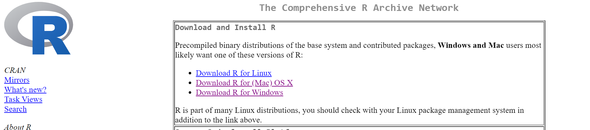
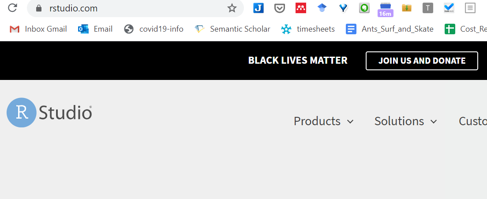

# Programming prerequisites

This chapter gives a quick overview of the prerequisite tools needed to use this book. We will use these tools to build and develop courses in statistics.

This project combines a collection of tools and packages used in R and RStudio for statistical analysis. Each class or short project can be found in the `drafts` folder. Currently this only has Dylans class notes.

To begin working in this open science (free) framework there are a collection of programs that make the process much more fluient. This is different for everyone but as I build and develop code on my personal computer these are the programs I use:

- [Typora]
- [GIT]
- [GIThub]
- [Visual Studio Code]
- [R]
- [RStudio]
- [Pandoc]

Less frequently:

- [Python]

- Microsoft standards
  - [Word]
  - [Excel]
  - [Powerpoint]
  
- [Ruby]


Setup and running projects using a reproducible pipeline of tools results in having to combine many different tools but the outcome is a workflow that reduces having to repeat simple teaching actions and have evidence of your resources on the fly.

### Files and folders

The project folder is hosted on `github` in a private repository that we are both collaborators on. 

#### GIT

The version control system commonly used for computer programming projects.

#### GIThub

The file storage system for GIT. This is an online repository and file storage system.

You can just download a zip file of the repository "as is" by:


Or you can "fork" the repository and work like I have here in the demo I quickly recorded using visual studio code to work with the `git` repository.


## Statistics

To teach statistics one of the most important aspects in the examples and demostrations. This can be seen as a toolkit to reproduce this with modifications to the interesting bits (data and visualisations) but with the same core statistical resources supporting the application.

### R

This is the statistical program that runs all of the work with numbers and other analysis/visualisations.



```{block, type='do-something'}

The key R skills you need to have in place to use this book will be revised in the first two practical sessions.

**Transfer/NEW one-on-one students**

The material in this chapter won't make any sense at the moment if you are an Environmental Sciences student joining us from Geography, or a student transferring into APS from a different department. Don't panic! You will have the opportunity to catch up in the first few weeks.
```

### RStudio

The interactive interface for R. Also known as a GUI.



## Starting an R session in RStudio

Here is the process you should go through every time you start a new R session:

1. Open up RStudio and set your working directory. 

Do this via the RStudio menu system: **Session ▶ Set Working Directory ▶ Choose Working Directory...**. Be sure to choose a sensible location. The working directory is where R will look for data files and R scripts. It's simplest to use the same working directory in every practical, but it isn't necessary to do this.

2. Open up a new R script using the RStudio menu system: **File ▶ New File ▶ R Script**. This will create (but not save) an empty, unnamed R script. Don't create any other kind of file unless you already know how to use R Notebooks or R Markdown files.

3. There are a few of things that regularly appear at the start of a script, e.g. we often start by clearing the workspace with `rm` and loading packages with `library`. Add these preamble chunk of code (and comments!) before doing anything else:

```{r, eval=FALSE}
# clear the workspace so that we have a 'clean sheet'
rm(list = ls())

# load and attach the packages we want to use...
# 1. 'dplyr' for data manipulation
library(dplyr)
# 2. 'ggplot2' for plotting
library(ggplot2)
```

4. Now run the preamble section of the script, i.e. highlight everything and hit **Ctrl+Enter**. If the `library` commands didn't work the relevant package probably isn't installed yet. Install the package (see below) and try rerunning the script.

5. Look at the label of the tab the script lives in. This will probably be called something like *Untitled1* and the label text will be red. This is RStudio signalling that the file has not yet been saved. So after the preamble part of the script is working, save the script in the working directory!

Now we're ready to start developing the script.

## Using packages

R packages extend the basic functionality of R so that we can do more with it. In a nutshell, an R package bundles together R code, data, and documentation in a standardised way that is easy to use and share with other users. This book uses a subset of the [tidyverse](https://www.tidyverse.org) ecosystem of packages: the `dplyr` package for data manipulation, and the `ggplot2` package for making plots. We need to understand how R's package system works to use these. 

Here's the key point: Installing a package, and then loading and attaching the package, are different operations. We only have to install a package once onto our computer, but we have to load and attach the package every time we want to use it in a new R session (i.e. every time we start RStudio). If that doesn't make any sense, revise the [package system](http://dzchilds.github.io/aps-data-analysis-L1/help-packages.html) chapter in the APS 135 course book.

Installing a package can be done via the `install.packages` function, e.g.

```{r, eval=FALSE}
install.packages("dplyr")
```

There's no need to leave `install.packages` statements in an R script. Loading and attaching a package so that it can actually be used happens via the `library` function, e.g.

```{r, eval=FALSE}
library("dplyr")
```

We do often leave `library` statements in scripts.

### Text editors


#### Typora

A great markdown editor (a way of viewing and editing text files for the internet and other things).


I also like using the text editor here (Typora) for spell checking and screenshots.
